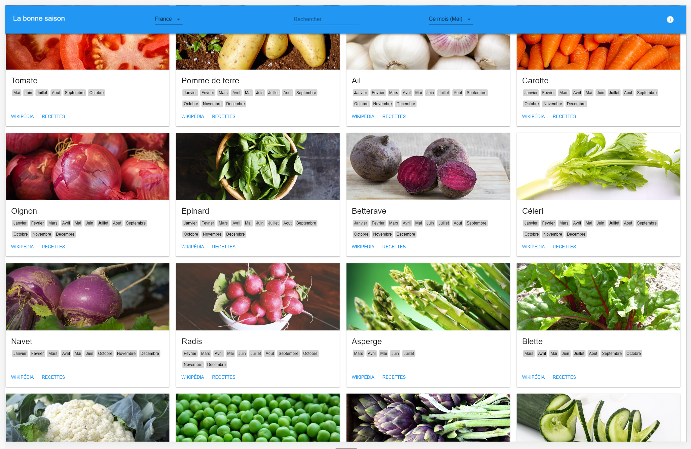

# Right season

:green_apple: :sweet_potato: :ear_of_rice: :mushroom: A simple react app that's mean't to answer only one question : is it the right season to buy this fruit/vegetable/cereal/mushroom ?

:tractor: Currently under devlopment, pull request for new feature or whole refactor are not accepted by now.

:tractor: Searchin for chinese artichoke CC0 (or equivalent) jpg :tractor:

## Sources 

The app use the following source for data : 
1. [https://www.greenpeace.fr/calendrier-fruits-legumes-de-saisons/](https://www.greenpeace.fr/calendrier-fruits-legumes-de-saisons/)

2. Common knowledge

For now app only provides data for France, but it's mean't to be extensible in term of data and localization. (See F.A.Q below for contribution or extensibility)

Images has been found on : 

1. https://www.pexels.com

2. https://pixabay.com

All images are choosen because of their licence [CC0](https://creativecommons.org/publicdomain/zero/1.0/deed.fr)

## Get started

First of all you need `Node.js` and optionnaly `yarn`. 

*NB if you didn't get `yarn` replace all following `yarn` occurences by `npm`*

To setup the project (retrieve dependencies) run `yarn install` (or `npm install`)

### Datamodel

Here are the fields of the data model and their signification

    name : Name of the Fruit/Vegetable/... it's the same name value whatever the source as it's use in i18n

    type : Type of the entry : vegetable|cereal|fruit|mushroom

    origin : <country of the file>|foreign

    availability : Tells when the item is in season. Month indexes separated by ,

    url : Url that provide info about the entry baiscally a wikipedia url

    image_url : Path to image

## Scripts

There are some ready to use scripts define in `package.json`

To build the app with uncompressed sources

    yarn build

To build the app ready for release with minified and compressed sources

    yarn release

To lint your code

    yarn lint

To run your code locally with uncompressed sources (on port 3000) :

    yarn run-dev

To run your code locally like in relase with minified and compressed sources (on port 3001) :

    yarn run-prod

## F.A.Q

**Q 1. How to contribute ?**

You can contribute for everything : functionnalities/bug fix/new language support/data for a new country.

First read the whole F.A.Q. Fork the project then make a pull request.

If you add new images it must be [CC0](https://creativecommons.org/publicdomain/zero/1.0/deed.fr) if the images are yours you accept that it becomes CC0.

If you add data please provide your sources.

**Q 2. How to add a new language ?**

Translation is provided via `translations.json` saved in `src/assets/i18n/`. Edit this file by adding a new entry. Use `fr-FR` as reference (for key to translate) as it's the main supported language.

**Q 3. How to add new data ?**

1. Fill a new xls file like the one provided in `/data` : do not change first column.

2. Generate json file. (see Q. 4)

3. Put generated json file in `src/assets/data/`

4. Edit `src/assets/config.json` in order to reference your new file.

**Q 4. How to (re-)generate data ?**

For convenience data are provided as an xls file. 

To generate json what you have to do is go to `data` folder an run with python 3 `generate.py <file.csv>` this will create/update a json file with the same name of your `.csv` by reading the provided `.csv`.

*NB This csv could be generated via excel/google drive from an `.xlsx`*

**Q 5. How to add new entry ?**

1. Add new entry in `data` and generate json.

2. Add i18n key in `names` object. The key must be equal to first column of xlsx.

**Q 6. Hey I disagree with some of your data, what can I do ?**

Create an issue.

## Usefull links
- https://material-ui-next.com/
- https://appdividend.com/2017/08/23/redux-tutorial-example-scratch/
- https://github.com/i18next/react-i18next
- https://material-ui-next.com/layout/grid/

## i18n

i18n is done thanks to `react-i18next` for now there's only one supported locale : `fr-FR`. If you want to contribute by adding a new locale. Everything goes in `src/components/i18n/translations`.

## Possible improvements

1. [done] ~~i18n~~
2. [done] ~~Allow configuration (i18n && variables) without rebuilding~~
3. [done] ~~Allow different countries indepently from language~~
4. Reduce image size via [Guetzli](https://github.com/google/guetzli)
5. Publish a demo of this app

## Based on 

[This toolkit](https://github.com/MarcAlx/simple-react-starterkit)

## License

License: MIT license
